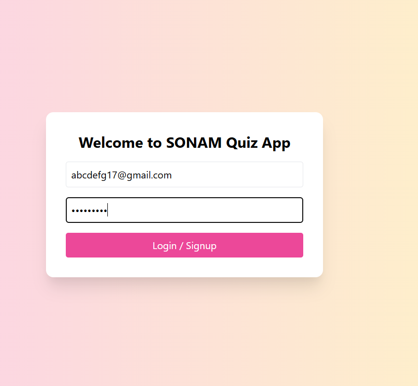
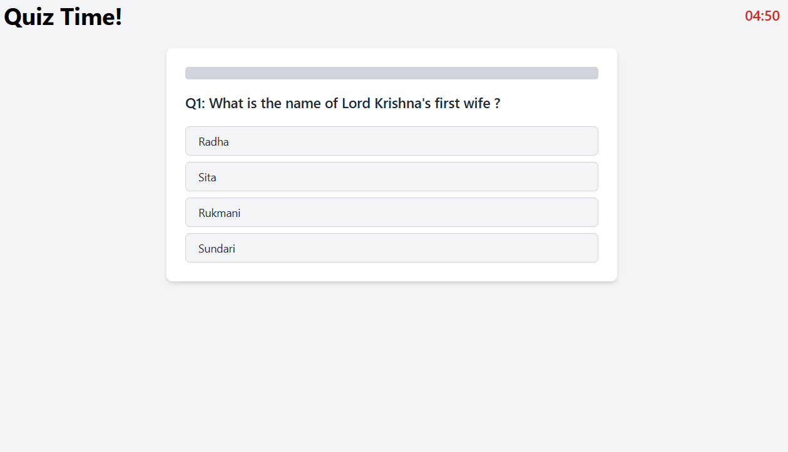

# Quiz_app_project
# SONAM Quiz App 🎯

A frontend quiz application that lets users create quizzes from text, take quizzes one question at a time, and see results with emojis.

## ✨ Features

- 🔐 Login/Signup (Email & Password)
- 📥 Upload or paste text (max 5000 words)
- 🔢 Generate any number of questions from the uploaded text
- 🤖 Automatically creates MCQs with 4 options
- ✍️ Add questions manually
- 🔄 Randomized questions and answers
- ⏱️ Quiz with timer and progress bar
- 📊 Result page with emoji feedback

## 📸 Screenshots

## 🚀 How to Run

1. Clone or download the repo
2. Open `index.html` in your browser
3. Create quizzes and test away!

